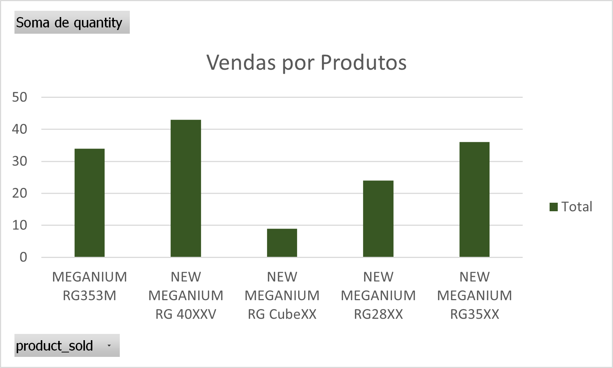
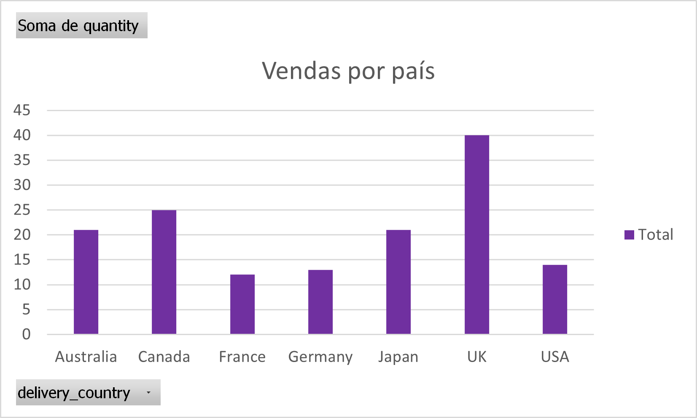
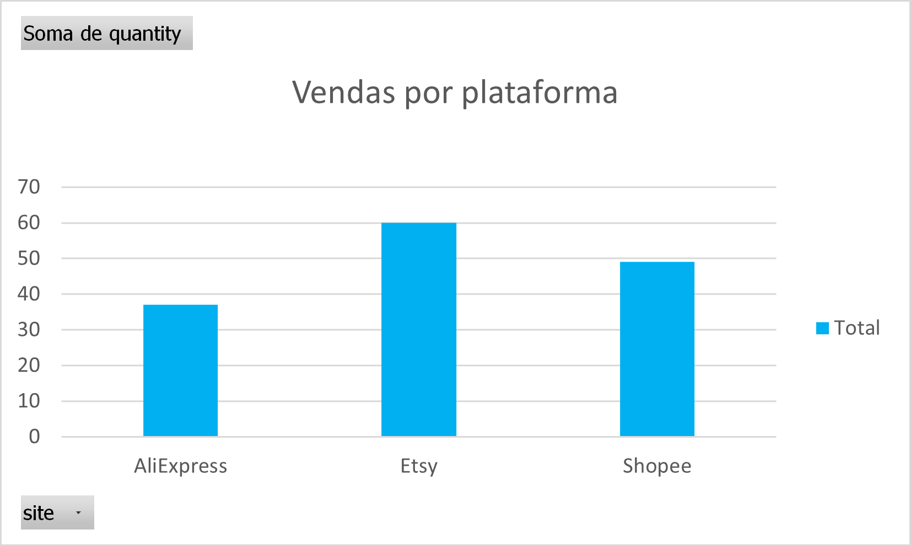

# 📊 Análise de Vendas com Inteligência Artificial

## 🚀 Sobre o Projeto

Este projeto tem como objetivo analisar dados de vendas de um e-commerce utilizando inteligência artificial para gerar insights estratégicos e apoiar a tomada de decisão.

A análise foi realizada a partir de dados reais de vendas provenientes de diferentes plataformas, com foco na identificação de padrões, oportunidades de crescimento e possíveis pontos de melhoria no negócio.

---

## 🎯 Objetivos

* Gerar insights estratégicos a partir de dados de vendas
* Aplicar conceitos de análise de dados em um cenário prático
* Utilizar prompts estruturados para extração de informações com IA
* Documentar o processo de forma clara e organizada
* Utilizar o GitHub como ferramenta de portfólio técnico

---

## 🧠 Tecnologias e Ferramentas

* Inteligência Artificial (ChatGPT)
* Microsoft Excel
* Git e GitHub
* Visual Studio Code

---

## 📂 Estrutura do Projeto

```bash
data/
├── raw_data/
│   ├── aliexpress.csv
│   ├── shopee.csv
│   └── etsy.csv
│
└── processed_data/
    └── meganium_sales_data.xlsx

prompts/
└── prompts.md

insights/
└── insights.md
```

---

## 🔄 Processamento de Dados

Os dados foram organizados em duas camadas:

* **Raw Data:** Dados brutos, sem alterações, provenientes das plataformas de venda
* **Processed Data:** Dados tratados e consolidados em uma única base para facilitar a análise

Essa abordagem garante maior confiabilidade, rastreabilidade e organização do projeto.

---

## 🤖 Uso de Inteligência Artificial

Foram utilizados prompts estruturados para orientar a análise dos dados, simulando o trabalho de um analista de dados em um ambiente real.

A estratégia incluiu:

* Análises específicas (produtos, países, plataformas, clientes)
* Análise geral consolidada
* Geração de insights e recomendações estratégicas

Os prompts utilizados estão documentados no arquivo:

📄 `prompts/prompts.md`

---

## 📊 Principais Insights

* Produtos como **RG 40XXV** apresentam alta demanda e frequência de vendas
* A plataforma **Shopee** se destaca como principal canal de vendas
* Mercados como **UK, USA e Canada** possuem forte presença nas compras
* O uso de cupons de desconto é frequente, podendo impactar a margem de lucro
* O público é diversificado, com ampla faixa etária
* Há indícios de sazonalidade nas vendas

📄 Mais detalhes em: `insights/insights.md`

---

## 📊 Visualização dos Dados




---

## ⚠️ Pontos de Atenção

* Presença de múltiplas moedas (EUR, USD, GBP), o que pode impactar a análise financeira
* Necessidade de padronização monetária para análises mais precisas

---

## 🚀 Conclusão

A utilização de inteligência artificial permitiu extrair insights relevantes de forma rápida e eficiente, demonstrando o potencial dessa tecnologia no apoio à análise de dados e tomada de decisão.

Este projeto reforça a importância da combinação entre conhecimento analítico e ferramentas de IA para gerar valor em ambientes de negócio.

---

## 👨‍💻 Autor

**Kleber Rafael**

🔗 LinkedIn: https://www.linkedin.com/in/kleber-rafael-silva/


💻 GitHub: https://github.com/KleberRafael1

---

## ⭐ Considerações Finais

Este projeto foi desenvolvido como parte de um desafio prático com foco em análise de dados e uso de inteligência artificial, com o objetivo de consolidar conhecimentos e construir um portfólio profissional.
