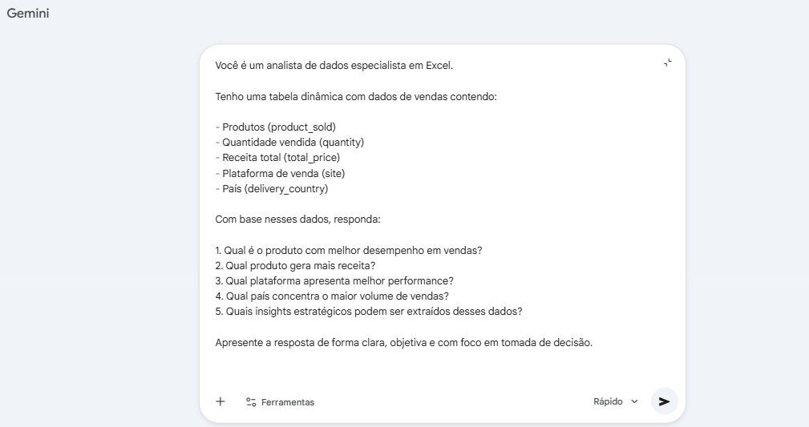
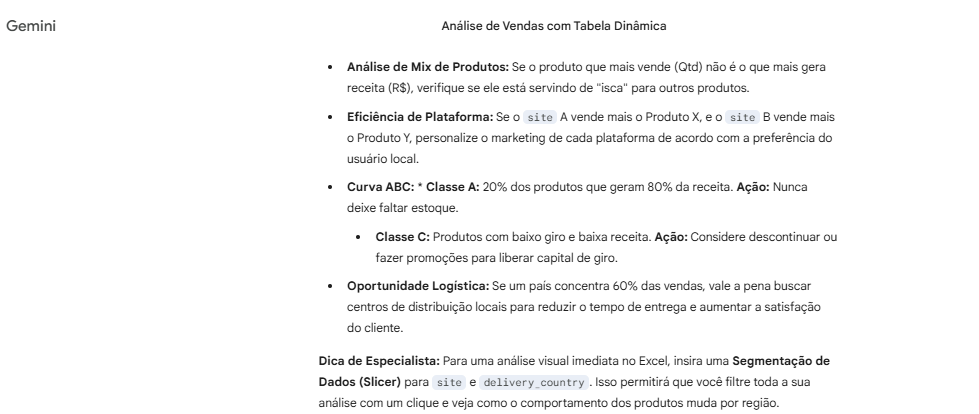

# 🤖 AI Project Documentation

## 🚀 Visão Geral

Este repositório tem como objetivo demonstrar como utilizar inteligência artificial para criar documentações técnicas de forma clara, estruturada e eficiente.

A proposta é mostrar, na prática, como ferramentas de IA podem auxiliar desenvolvedores e analistas na organização de projetos, geração de conteúdo técnico e melhoria da comunicação.

---

## 🎯 Objetivo

* Demonstrar o uso de IA na criação de documentação técnica
* Estruturar informações de forma clara e profissional
* Criar um modelo reutilizável para qualquer projeto
* Aumentar a produtividade na documentação

---

## 🧠 Ferramentas Utilizadas

* ChatGPT (geração de documentação e textos)
* Microsoft Copilot (opcional)
* GitHub (armazenamento e versionamento)
* Visual Studio Code (edição)

---

## 📂 Estrutura do Projeto

```bash id="d8c2b7"
ai-project-documentation/
│
├── README.md
└── images/
```

---

## 🤖 Como Utilizar Inteligência Artificial na Documentação

A inteligência artificial pode ser aplicada em diferentes etapas da documentação:

### 📌 1. Geração de Estrutura

Exemplo de prompt:

```text id="c9r2af"
Crie a estrutura de um README profissional para um projeto de software, incluindo seções como objetivo, tecnologias, uso e conclusão.
```

---

### 📌 2. Escrita de Conteúdo

```text id="1z9x7p"
Explique de forma clara e profissional o objetivo de um projeto de análise de dados utilizando inteligência artificial.
```

---

### 📌 3. Organização e Clareza

```text id="a3k8zq"
Reescreva o texto abaixo de forma mais clara, objetiva e profissional.
```

---

### 📌 4. Geração de Insights

```text id="l2m8q1"
Analise os dados abaixo e gere insights estratégicos para tomada de decisão.
```

---

## 🔄 Fluxo de Documentação com IA

1. Definir o objetivo do projeto
2. Utilizar IA para estruturar o README
3. Gerar descrições e explicações
4. Refinar o conteúdo com prompts
5. Organizar visualmente (títulos, listas, imagens)

---

## 📊 Exemplo Prático

Como aplicação real, foi utilizado um projeto de análise de vendas com inteligência artificial, onde a IA auxiliou em:

* Criação da documentação
* Estruturação de prompts
* Geração de insights
* Organização das informações

---

## 📸 Exemplo de uso de IA na análise de dados

A imagem abaixo demonstra a utilização de inteligência artificial para interpretação de uma tabela dinâmica no Excel:





---


## 📸 Exemplos Visuais


---

## 💡 Benefícios do Uso de IA

* Aumento de produtividade
* Padronização da documentação
* Melhor clareza na comunicação
* Facilidade na organização de ideias
* Apoio na análise de dados

---

## ⚠️ Boas Práticas

* Sempre revisar o conteúdo gerado pela IA
* Adaptar o texto para o contexto do projeto
* Utilizar prompts claros e objetivos
* Evitar dependência total da IA

---

## 🚀 Conclusão

A inteligência artificial se mostra uma poderosa aliada na criação de documentações técnicas, permitindo maior agilidade, organização e qualidade na apresentação de projetos.

Este repositório serve como um guia prático para aplicação desses conceitos em diferentes cenários.

---

## 👨‍💻 Autor

**Kleber Rafael**

🔗 LinkedIn: https://www.linkedin.com/in/kleber-rafael-silva
💻 GitHub: https://github.com/KleberRafael1

---

## ⭐ Considerações Finais

Este projeto demonstra, na prática, como a inteligência artificial pode ser utilizada como ferramenta de apoio no desenvolvimento e documentação de projetos, sendo um diferencial importante no mercado atual.
